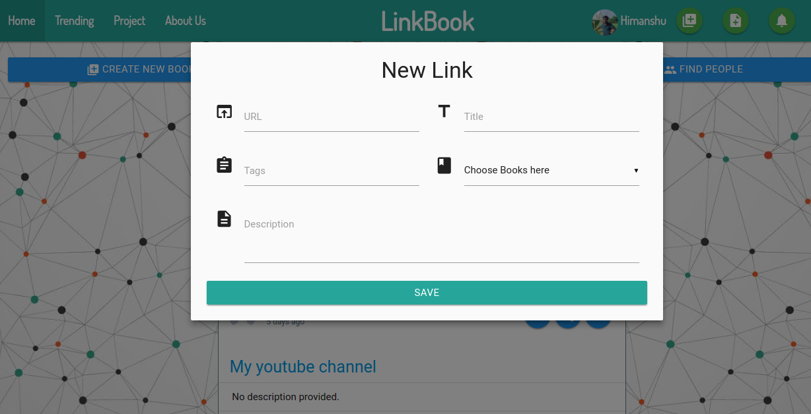
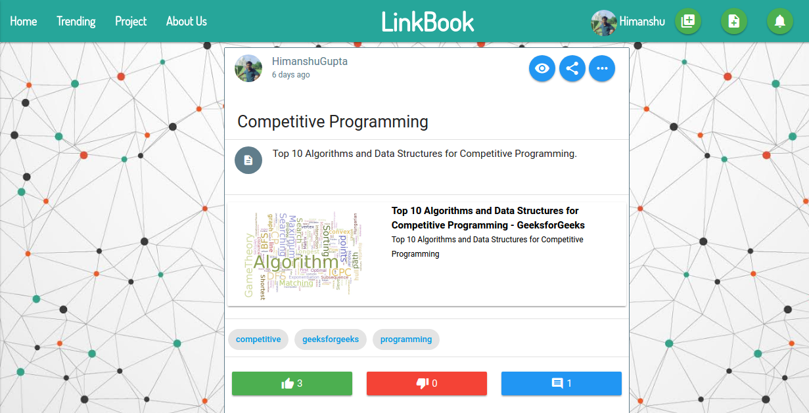
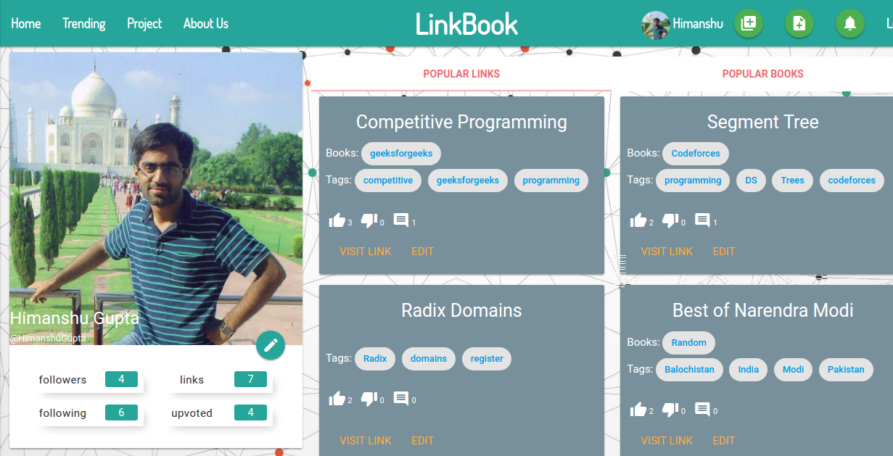
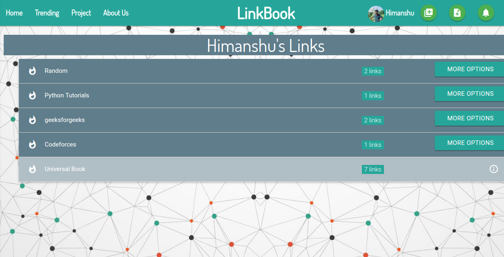
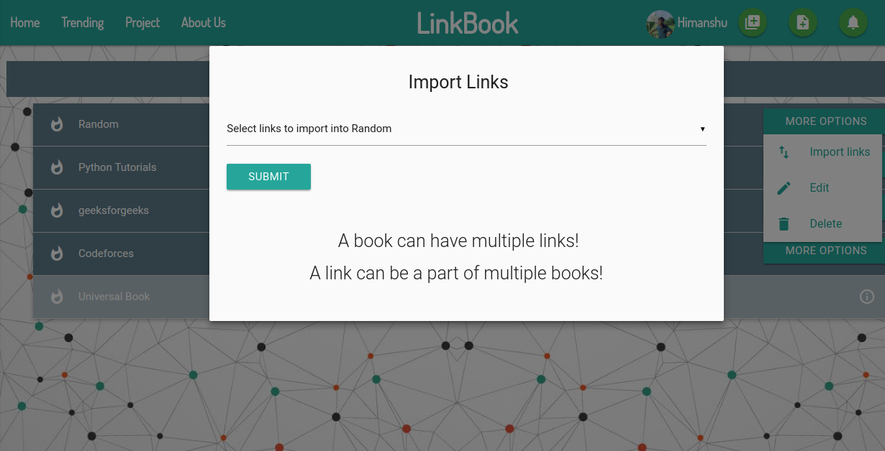
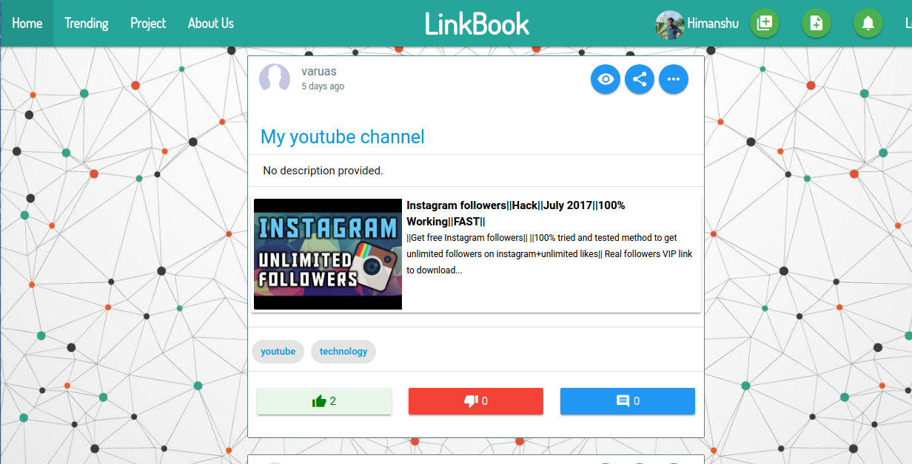
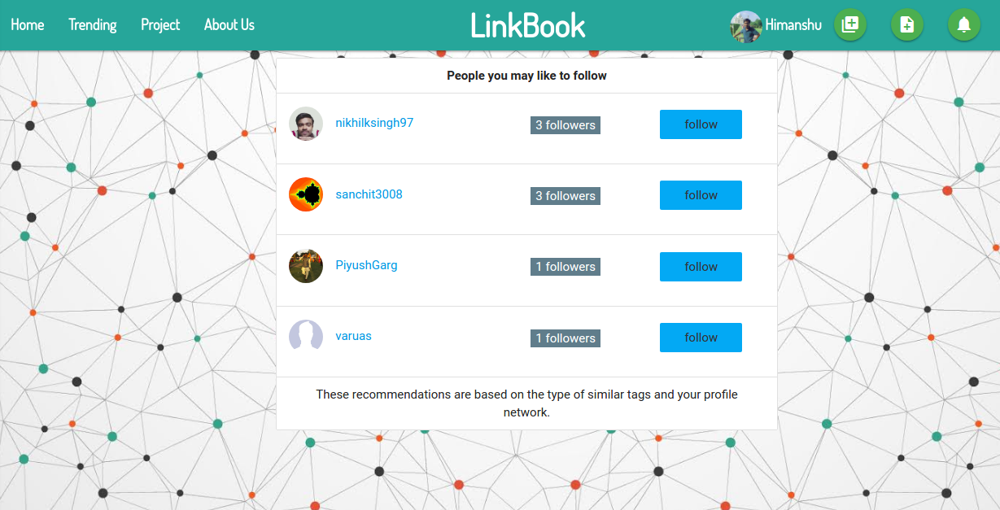
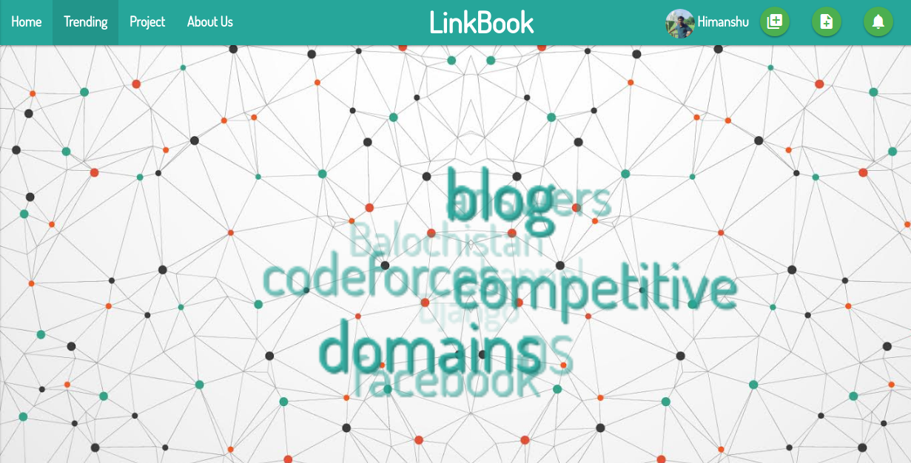

#LinkBook
######A social media for links! Linkbook allows you to create, manage, explore and share links.

####Link : [http://link-book.herokuapp.com/](http://link-book.herokuapp.com/)

### Technologies And Frameworks
1. [Django](https://www.djangoproject.com/)
2. [SQLite](https://www.sqlite.org/)
3. [Materialize](http://materializecss.com/)

### Features
1. Create and store links.

2. Group these links into books and manage them accordingly.

3. See what others have shared and the facility to upvote, downvote and comment on links.

4. See recommendations to follow on the basis of your tags, and links.

5. See whats trending and explore the shared links on it.

 